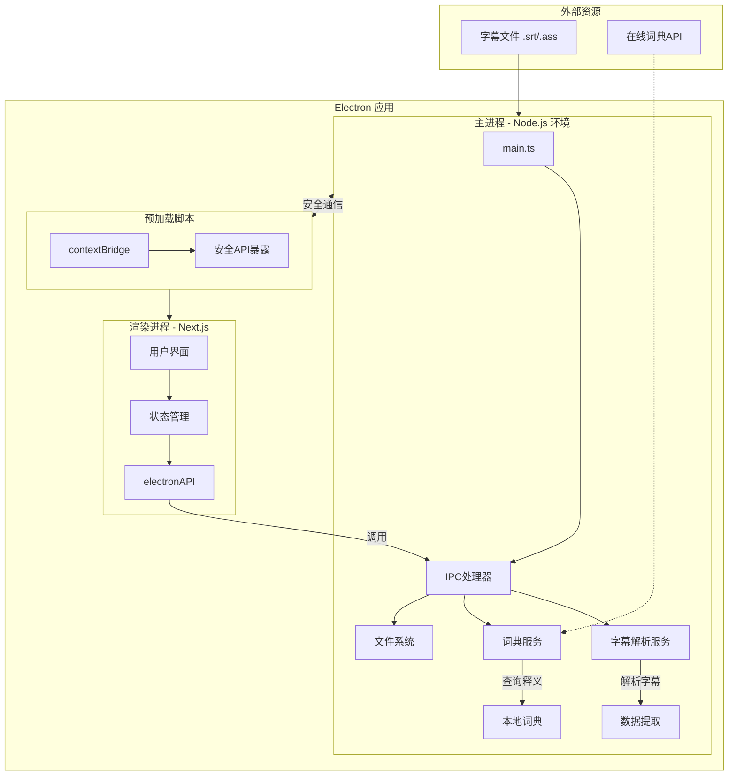
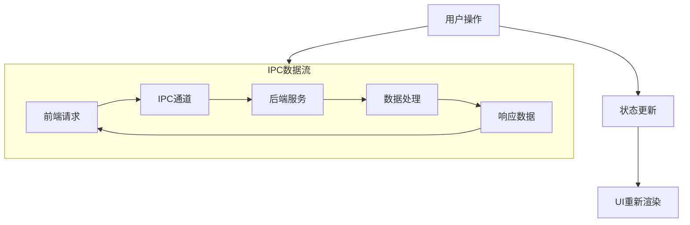

# 系统架构与设计模式

## 总体架构

项目采用 Electron 的主进程/渲染进程架构，结合 Next.js 作为渲染层：



## 核心设计模式

### 1. 服务层模式 (Service Layer Pattern)

每个业务功能都有专门的服务类负责：

```typescript
// 服务基础结构
interface Service {
  initialize(): Promise<void>;
  cleanup(): void;
}

// 具体服务实现
class SubtitleParserService implements Service {
  // 单一职责：字幕解析
}

class DictionaryService implements Service {
  // 单一职责：词典查询
}
```

**优势：**

- 职责分离，便于测试和维护
- 可独立扩展每个服务
- 易于实现依赖注入

### 2. 命令模式 (Command Pattern) - IPC 通信

IPC 通信采用命令模式，每个操作对应一个命令：

```typescript
enum IPC_CHANNELS {
  OPEN_SUBTITLE_FILE = 'open-subtitle-file',
  PARSE_SUBTITLE_FILE = 'parse-subtitle-file',
  LOOKUP_WORD = 'lookup-word',
}
```

**优势：**

- 类型安全的通信
- 易于添加新命令
- 统一的错误处理

### 3. 策略模式 (Strategy Pattern) - 字幕解析

支持多种字幕格式的解析策略：

```typescript
interface SubtitleParsingStrategy {
  canParse(content: string): boolean;
  parse(content: string): SubtitleEntry[];
}

class SrtParsingStrategy implements SubtitleParsingStrategy {
  // SRT格式解析
}

class AssParsingStrategy implements SubtitleParsingStrategy {
  // ASS格式解析
}
```

### 4. 观察者模式 (Observer Pattern) - 状态管理

前端使用 React 的状态管理，遵循观察者模式：

```typescript
// 状态变化自动触发UI更新
const [subtitleEntries, setSubtitleEntries] = useState<SubtitleEntry[]>([]);
const [selectedWord, setSelectedWord] = useState<string>('');
```

## 数据流架构

### 单向数据流



### 类型安全数据传输

```typescript
// 共享类型定义确保前后端数据一致性
export interface SubtitleEntry {
  index: number;
  startTime: string;
  endTime: string;
  text: string;
}

export interface WordEntry {
  word: string;
  count: number;
}

export interface DictionaryEntry {
  word: string;
  phonetic?: string;
  definitions: string[];
  translation?: string;
  examples?: string[];
}
```

    MainProcess --> IPC --> Renderer
    Renderer -->|Action| IPC
    IPC -->|Event| MainProcess

````

### 3. 组件设计原则

- 采用函数式组件和 Hooks
- 关注点分离，每个组件只负责特定功能
- 使用 TypeScript 接口确保类型安全

## 关键接口

### IPC 通信接口

主进程和渲染进程通过以下 IPC 接口通信：

- **字幕处理**:

  - `parse-subtitle-file`: 解析字幕文件
  - `get-subtitles`: 获取当前字幕
  - `get-subtitle-at-time`: 获取指定时间的字幕
  - `get-words-near-time`: 获取时间点附近的单词
  - `get-word-mappings`: 获取单词时间映射

- **词典查询**:

  - `translate-word`: 翻译单词
  - `get-word-definition`: 获取单词详细定义

- **学习记录**:

  - `save-learned-word`: 保存学习的单词
  - `get-learned-words`: 获取已学习单词列表
  - `update-word-status`: 更新单词状态

- **文件操作**:

  - `open-video-file`: 打开视频文件
  - `open-subtitle-file`: 打开字幕文件
  - `save-config`: 保存配置

- **应用设置**:
  - `get-settings`: 获取应用设置
  - `update-settings`: 更新应用设置

### 数据存储

使用 electron-store 进行本地数据持久化：

- **配置存储**: 用户设置和首选项
- **词典存储**: 本地词典数据
- **学习记录**: 学习进度和已知单词列表

## 开发规范与代码质量管理

### 代码质量工具

- **ESLint**: 采用 ESLint v9 的扁平配置格式(eslint.config.js)，分别为主进程、渲染进程和共享代码设置不同的规则集：
  - 主进程规则：允许 console 使用，设置 Node 环境全局变量
  - 渲染进程规则：设置浏览器环境全局变量
  - 共享代码规则：严格类型检查
  - 类型定义文件：放宽未使用变量检查

### 开发工作流

- **代码提交前**: 运行 lint 检查确保代码质量
- **API 开发**: 先定义接口，后实现功能，保持类型安全
- **测试驱动**: 重要功能采用测试驱动开发

## 安全模式

### 1. 进程隔离
- 主进程和渲染进程严格分离
- 渲染进程无法直接访问 Node.js API
- 通过预加载脚本安全暴露必要功能

### 2. Context Bridge 安全模式
```typescript
// 预加载脚本中的安全API暴露
contextBridge.exposeInMainWorld('electronAPI', {
  openSubtitleFile: () => ipcRenderer.invoke(IPC_CHANNELS.OPEN_SUBTITLE_FILE),
  parseSubtitleFile: (filePath: string) =>
    ipcRenderer.invoke(IPC_CHANNELS.PARSE_SUBTITLE_FILE, filePath),
  lookupWord: (word: string) =>
    ipcRenderer.invoke(IPC_CHANNELS.LOOKUP_WORD, word)
});
````

### 3. 类型安全验证

```typescript
// 运行时类型检查
function isValidSubtitleEntry(entry: any): entry is SubtitleEntry {
  return (
    typeof entry.index === 'number' &&
    typeof entry.startTime === 'string' &&
    typeof entry.endTime === 'string' &&
    typeof entry.text === 'string'
  );
}
```

## 性能优化模式

### 1. 懒加载策略

```typescript
// 词典数据按需加载
class DictionaryService {
  private dictionaryCache = new Map<string, DictionaryEntry>();

  async lookupWord(word: string): Promise<DictionaryEntry | null> {
    if (this.dictionaryCache.has(word)) {
      return this.dictionaryCache.get(word)!;
    }
    // 动态加载词典数据
  }
}
```

### 2. 数据缓存模式

```typescript
// 解析结果缓存
class SubtitleParserService {
  private parseCache = new Map<string, ParsedSubtitle>();

  async parseSubtitle(filePath: string): Promise<ParsedSubtitle> {
    const cacheKey = `${filePath}:${this.getFileHash(filePath)}`;
    if (this.parseCache.has(cacheKey)) {
      return this.parseCache.get(cacheKey)!;
    }
    // 解析并缓存结果
  }
}
```

### 3. 异步处理模式

```typescript
// 非阻塞的文件处理
async function processLargeSubtitleFile(filePath: string): Promise<ParsedSubtitle> {
  return new Promise((resolve, reject) => {
    const stream = fs.createReadStream(filePath);
    // 流式处理，避免内存占用过大
  });
}
```

## 错误处理模式

### 1. 统一错误处理

```typescript
// IPC 错误包装
export function wrapIpcHandler<T extends any[], R>(handler: (...args: T) => Promise<R>) {
  return async (...args: T): Promise<R> => {
    try {
      return await handler(...args);
    } catch (error) {
      console.error('IPC Handler Error:', error);
      throw new Error(`操作失败: ${error instanceof Error ? error.message : '未知错误'}`);
    }
  };
}
```

### 2. 用户友好的错误反馈

```typescript
// 前端错误状态管理
const [error, setError] = useState<string | null>(null);
const [loading, setLoading] = useState<boolean>(false);

const handleOperation = async () => {
  try {
    setLoading(true);
    setError(null);
    await window.electronAPI.someOperation();
  } catch (err) {
    setError(err instanceof Error ? err.message : '操作失败');
  } finally {
    setLoading(false);
  }
};
```

## 可扩展性模式

### 1. 插件架构预留

```typescript
// 为未来功能扩展预留接口
interface FeaturePlugin {
  name: string;
  version: string;
  initialize(): Promise<void>;
  cleanup(): void;
}

class PluginManager {
  private plugins = new Map<string, FeaturePlugin>();

  registerPlugin(plugin: FeaturePlugin) {
    this.plugins.set(plugin.name, plugin);
  }
}
```

### 2. 配置驱动模式

```typescript
// 应用配置管理
interface AppConfig {
  dictionarySource: 'local' | 'online' | 'hybrid';
  supportedFormats: string[];
  performance: {
    cacheSize: number;
    maxFileSize: number;
  };
}
```

### 3. 数据格式版本化

```typescript
// 数据格式版本管理
interface DataFormat {
  version: string;
  migrate?(oldData: any): any;
}

interface SavedLearningProgress extends DataFormat {
  version: '1.0.0';
  words: WordProgress[];
  lastUpdated: string;
}
```

## 测试模式

### 1. 依赖注入测试

```typescript
// 便于单元测试的构造函数注入
class SubtitleParserService {
  constructor(private fileSystem: FileSystemInterface = new NodeFileSystem()) {}
}

// 测试时注入 Mock
const mockFileSystem = new MockFileSystem();
const parser = new SubtitleParserService(mockFileSystem);
```

### 2. IPC 测试模式

```typescript
// IPC 通信的测试封装
export function createTestIPCEnvironment() {
  const mockIpc = {
    invoke: jest.fn(),
    handle: jest.fn(),
  };
  return mockIpc;
}
```
