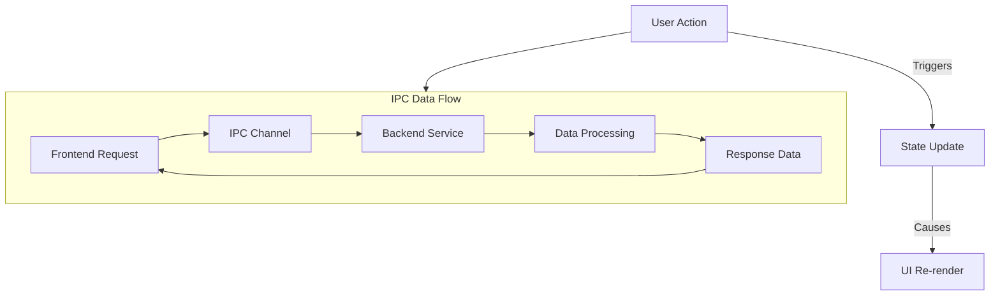

# System Design Patterns

## 1. Core Architecture: Electron Main/Renderer Process Model

This application follows the fundamental architectural pattern of an [Electron](https://www.electronjs.org/docs/latest/tutorial/process-model) application, which is composed of two distinct process types:

-   **Main Process**: Acts as the application's backend and entry point. It has access to Node.js APIs and is responsible for managing native desktop functionalities like creating windows, handling file system operations, and managing the application lifecycle. In this project, the main process code resides in `src/main/`.

-   **Renderer Process**: Acts as the application's frontend. Each browser window (`BrowserWindow` instance) runs its own renderer process. It is responsible for rendering the user interface using web technologies. In this project, the renderer process is a [Next.js](https://nextjs.org/) application located in `src/renderer/`.

This separation allows us to leverage web technologies for the UI while still having access to the underlying operating system's capabilities.

## 2. Communication: Inter-Process Communication (IPC)

Communication between the main process and renderer processes is achieved through Electron's Inter-Process Communication (IPC) modules. We use a structured and type-safe approach:

-   **IPC Channels**: Defined in `src/shared/ipc.ts`, creating a single source of truth for channel names.
-   **Type-Safe Contracts**: We use `ipcMain.handle` in the main process and `ipcRenderer.invoke` in the renderer process for request-response style communication. The data structures for these communications are defined in `src/shared/types/` to ensure type safety between processes.
-   **Preload Script**: A preload script (`src/main/preload.ts`) is used to securely expose specific IPC functionalities to the renderer process, rather than exposing the entire `ipcRenderer` object.

```mermaid
flowchart TD
    subgraph Renderer Process (UI - Next.js)
        A[React Component] --> B{ipcRenderer.invoke('channel', ...args)};
    end

    subgraph Main Process (Backend - Node.js)
        C{ipcMain.handle('channel', ...)} --> D[Service Logic];
    end

    B -- IPC --> C;
    D -- Returns value --> C;
    C -- IPC Response --> B;
    B -- Returns Promise --> A;
```

## 3. Main Process Design: Service-Oriented Architecture

The main process logic is organized into a set of cohesive, single-responsibility services. This makes the code more modular, easier to test, and simpler to maintain.

-   **`FileService`**: Handles all file system interactions (e.g., opening file dialogs).
-   **`SubtitleService`**: Responsible for parsing and processing subtitle files.
-   **`StoreService`**: Manages persistent data and user settings via `electron-store`.

These services are instantiated in the main application entry point (`src/main/main.ts`) and their methods are exposed to the renderer process via the IPC handlers (`src/main/ipc-handlers.ts`).

## 4. UI Design: Component-Based Architecture with React

The renderer process, being a Next.js application, naturally follows a component-based architecture. Reusable UI components are located in `src/renderer/components/`. We utilize React Hooks (`src/renderer/hooks/`) for managing state and side effects within these components.

## 5. Data Flow: Unidirectional Data Flow

Data flow within the application follows a unidirectional pattern, ensuring that data changes propagate in a single direction, making the flow of data and events easier to understand and debug.

-   **State Management**: The application state is managed using React's built-in state management and Context API for global state.
-   **Data Fetching**: Data is fetched from the main process using IPC calls and then passed down to components as props.



## 6. Error Handling: Centralized Error Handling

The application implements a centralized error handling mechanism to gracefully handle and report errors.

-   **Main Process**: Catches unhandled errors and promise rejections, logging them and sending error details to the renderer process via IPC.
-   **Renderer Process**: Listens for error events from the main process and displays user-friendly error messages in the UI.

```typescript
// Main process error handling
process.on('uncaughtException', (error) => {
  console.error('Uncaught Exception:', error);
  // Notify renderer process
});

process.on('unhandledRejection', (reason, promise) => {
  console.error('Unhandled Rejection at:', promise, 'reason:', reason);
  // Notify renderer process
});
```

## 7. Security: Context Isolation and Preload Scripts

To enhance security, the application uses context isolation and preload scripts:

-   **Context Isolation**: Ensures that the renderer process has a separate context from the main process, preventing direct access to Node.js APIs.
-   **Preload Scripts**: A preload script is used to selectively expose safe APIs to the renderer process, using `contextBridge.exposeInMainWorld`.

```typescript
// preload.ts
contextBridge.exposeInMainWorld('api', {
  // Expose safe APIs
});
```

## 8. Performance Optimization: Efficient Data Handling

Performance optimizations are implemented to ensure efficient data handling and UI responsiveness:

-   **Lazy Loading**: Components and data are loaded on demand to reduce initial load time.
-   **Memoization**: React's `useMemo` and `useCallback` hooks are used to memoize expensive calculations and functions.
-   **Batching**: State updates are batched to minimize re-renders.

```typescript
// Example of memoization
const computedValue = useMemo(() => {
  return expensiveComputation(data);
}, [data]);
```

## 9. Testing: Comprehensive Testing Strategy

The application is developed with a strong emphasis on testing, employing various testing strategies:

-   **Unit Testing**: Individual functions and components are tested in isolation using Jest and React Testing Library.
-   **Integration Testing**: Tests ensure that different parts of the application work together as expected.
-   **End-to-End Testing**: The application is tested as a whole, simulating real user scenarios using tools like Spectron.

```typescript
// Example unit test
test('parses subtitle file correctly', async () => {
  const result = await SubtitleService.parseFile('test.srt');
  expect(result).toEqual(expectedParsedResult);
});
```

## 10. Accessibility: Inclusive Design Principles

The application is designed with accessibility in mind, following inclusive design principles:

-   **Semantic HTML**: Proper use of HTML elements to convey meaning and structure.
-   **ARIA Roles**: Use of ARIA roles and attributes to enhance accessibility of dynamic content.
-   **Keyboard Navigation**: Ensuring all interactive elements are accessible via keyboard.

```html
<!-- Example of ARIA role usage -->
<div role="alert" aria-live="assertive">
  Error: Unable to load subtitles.
</div>
```
