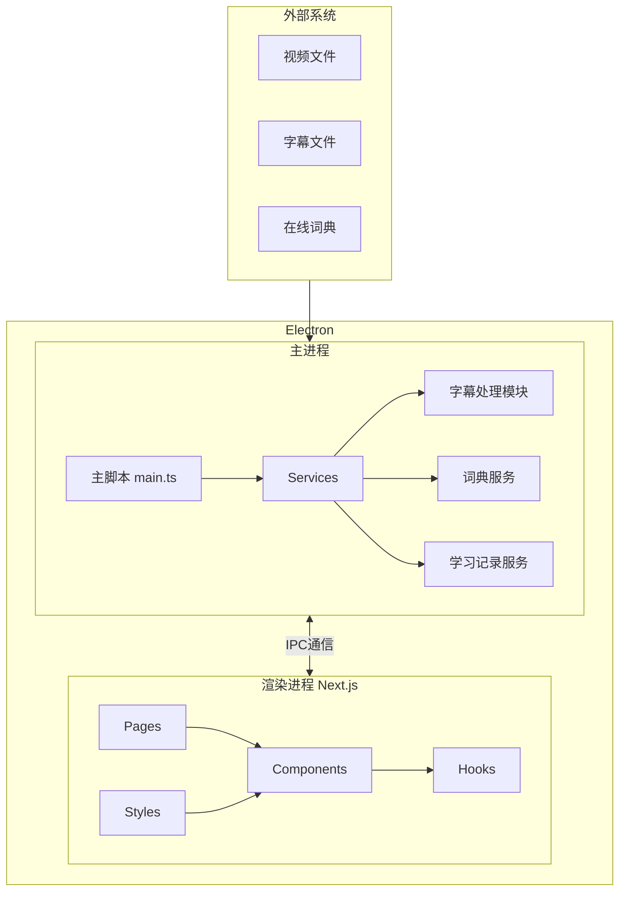
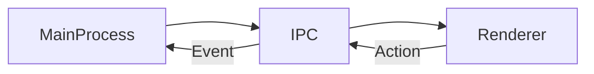

# 系统架构与设计模式

## 总体架构

项目采用 Electron 的主进程/渲染进程架构，结合 Next.js 作为渲染层：

## 核心设计模式

### 1. 服务模块化

项目采用服务模块化设计，每个功能领域有专门的服务类负责：

- **SubtitleParser**: 负责字幕文件解析
- **DictionaryService**: 管理词典查询功能
- **LearningRecordService**: 处理学习记录和进度

### 2. 数据流模型

采用单向数据流模型，确保数据流转清晰：

### 3. 组件设计原则

- 采用函数式组件和 Hooks
- 关注点分离，每个组件只负责特定功能
- 使用 TypeScript 接口确保类型安全

## 关键接口

### IPC 通信接口

主进程和渲染进程通过以下 IPC 接口通信：

- **字幕处理**:

  - `parse-subtitle-file`: 解析字幕文件
  - `get-subtitles`: 获取当前字幕
  - `get-subtitle-at-time`: 获取指定时间的字幕
  - `get-words-near-time`: 获取时间点附近的单词
  - `get-word-mappings`: 获取单词时间映射

- **词典查询**:

  - `translate-word`: 翻译单词
  - `get-word-definition`: 获取单词详细定义

- **学习记录**:

  - `save-learned-word`: 保存学习的单词
  - `get-learned-words`: 获取已学习单词列表
  - `update-word-status`: 更新单词状态

- **文件操作**:

  - `open-video-file`: 打开视频文件
  - `open-subtitle-file`: 打开字幕文件
  - `save-config`: 保存配置

- **应用设置**:
  - `get-settings`: 获取应用设置
  - `update-settings`: 更新应用设置

### 数据存储

使用 electron-store 进行本地数据持久化：

- **配置存储**: 用户设置和首选项
- **词典存储**: 本地词典数据
- **学习记录**: 学习进度和已知单词列表

## 开发规范与代码质量管理

### 代码质量工具

- **ESLint**: 采用 ESLint v9 的扁平配置格式(eslint.config.js)，分别为主进程、渲染进程和共享代码设置不同的规则集：
  - 主进程规则：允许 console 使用，设置 Node 环境全局变量
  - 渲染进程规则：设置浏览器环境全局变量
  - 共享代码规则：严格类型检查
  - 类型定义文件：放宽未使用变量检查

### 开发工作流

- **代码提交前**: 运行 lint 检查确保代码质量
- **API 开发**: 先定义接口，后实现功能，保持类型安全
- **测试驱动**: 重要功能采用测试驱动开发
